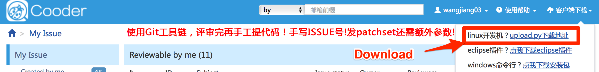
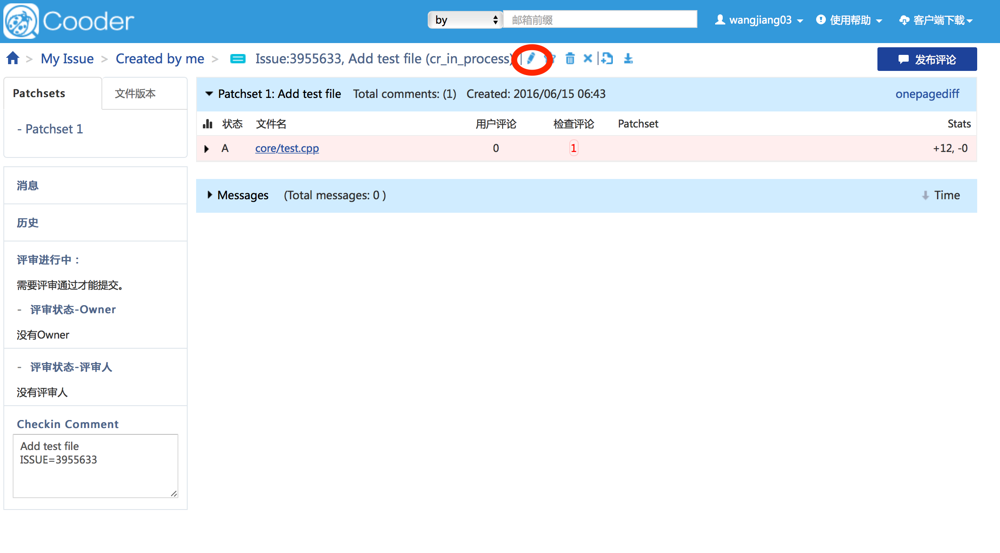
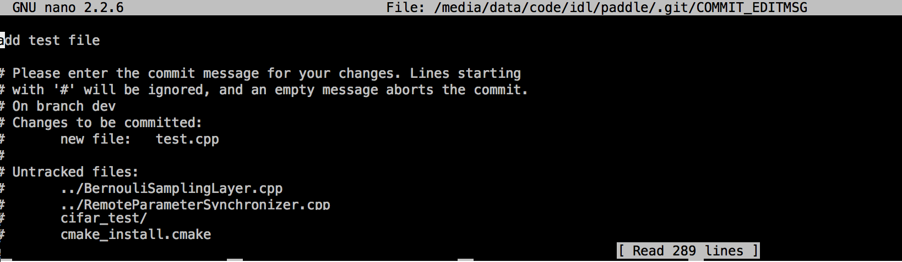

Contribute Code
===============

We use **GIT** as an example, and if you use **SVN**, find commands [here](http://svnbook.red-bean.com/en/1.7/svn.ref.html).

## Code Review

To contribute code to PaddlePaddle, one needs to go through the code review process.

### Download Script

To download `upload.py` to submit code review, address <http://cooder.baidu.com>, and click “客户端下载, Linux” 开发机. See following picture:



Then, enable the execution permission via:

```bash
chmod +x ./upload.py 
```

### Commit Changes

**NOTE**: We do not recommend to develop on `master` branch. In following example, we develop on`dev` branch, and assume `upload.py` is in the current directory.

+ Run the sample commands:

```bash
git checkout -b dev
touch test.cpp
git add test.cpp
git commit -m "add test file"
./upload.py
```

You will see following messages, where the issue_number is 3955633:


+ Follow the link on the screen to arrive at this page, which shows the changed list. You can review the details of the changes by clicking each file. After making sure all the changes are correct, click the circled icon.



+ Edit following fields, and click “保存“ after finishing the edit. It will automatically send emails to reviewers.

  - 评审人: reviewer email prefixes. **NOTE THAT** you must choose at least two members of `dangqingqing`, `yuyang18`, `luotao02`, `wangyanfei01`, `wangjiang03`, `xuwei06`.
  - 抄送人: CCed reviewer email prefixes. For PaddlePaddle commits, we always CC `paddle-sys`.
  - 描述信息： the detailed description of the changes.


+ If you make some further changes and want to update the cooder, use the following command:

```bash
./upload.py -i <issue_number>
```
## Check In

+ Change the commit message using the following command, and edit the commit message at the following page, where the last line of the message should be `ISSUE=<issue_number>`.

```bash
git commit -amend
```



+ Push the commit to **GIT** using:

```bash
git push origin dev:master
```

+ If you have more than one commits in a change, combine them into a single change before pushing. You can achieve it via **interactive rebasing**. See detailed documentation [here](https://git-scm.com/book/en/v2/Git-Branching-Rebasing).

```bash
git rebase --interactive master
```
